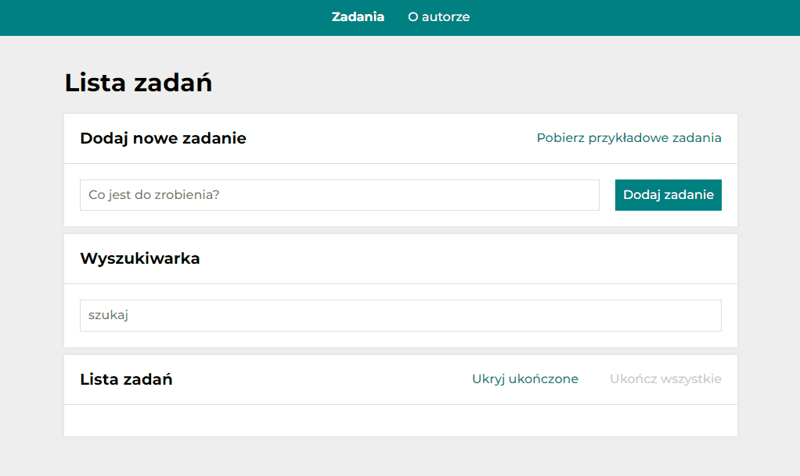

# To Do List - React

### 

adding tasks

removing

marking as done one, several or all

hide all marked as done

download sample tasks

searching for a task

# How it works

# DEMO  [See To Do List](https://karolinaj33.github.io/to-do-list-react/)

# Description
I have created a simply to do list.
You can add tasks, mark as completed and remove from the list. 
You can also mark as complete all the tasks by choosing 'Ukończ wszystkie'.
After pressing 'Ukryj ukończone' selected tasks will disappear from the list. You can also download sample tasks by 'Pobierz przykładowe zadania" or search for any task in the search engine.

# Technologies used
`React.js`
`React - Redux`
`React - Ruter`
`Redux Toolkit`
`Custom Hook (useEffect, useState, useRef)`
`Local Storage`
`HTML`
`BEM`
`CSS (Grid, Flex, media queries, transition)`
`JavaScript ES6+`
`Normalized.css`
`Styled-components`
`Theme Provider`
`GlobalStyles & Theme`
`JSX`
`Git`
`Webpack`
`Babel`

## Enjoy
This project was bootstrapped with [Create React App](https://github.com/facebook/create-react-app).

## Available Scripts

In the project directory, you can run:

### `npm start`

Runs the app in the development mode.\
Open [http://localhost:3000](http://localhost:3000) to view it in your browser.

The page will reload when you make changes.\
You may also see any lint errors in the console.

### `npm run build`

Builds the app for production to the `build` folder.\
It correctly bundles React in production mode and optimizes the build for the best performance.

The build is minified and the filenames include the hashes.\
Your app is ready to be deployed!

See the section about [deployment](https://facebook.github.io/create-react-app/docs/deployment) for more information.

